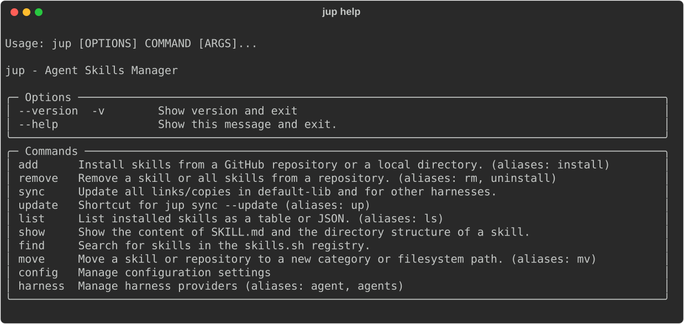
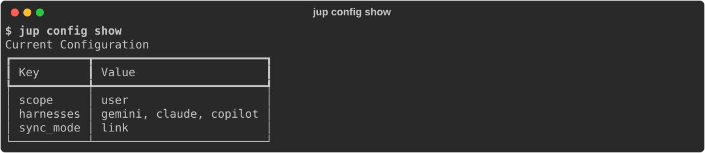
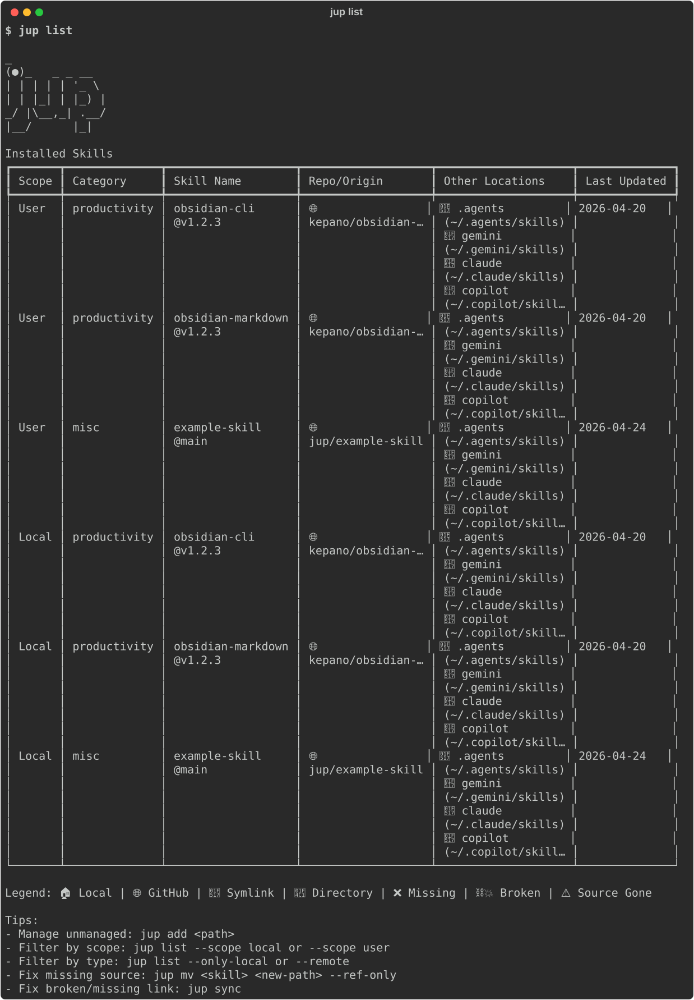

# jup ✨

`jup` es una pequeña herramienta de línea de comandos para instalar y sincronizar habilidades de agentes en los directorios de habilidades locales utilizados por los asistentes de IA compatibles.

### ¿Por qué `jup`? 💊
El nombre es una abreviatura de **"jump"** (salto), un guiño al **Jump Program** de *The Matrix*. Así como el programa era un terreno de entrenamiento fundamental para saltar entre edificios (y descubrir tu potencial), `jup` ayuda a tus agentes a "saltar" entre diferentes entornos y flujos de trabajo con las habilidades adecuadas.

Te ayuda a:

- instalar habilidades desde repositorios de GitHub que exponen una carpeta `skills/` de primer nivel (o `.claude/skills/` como alternativa)
- mantener las habilidades instaladas organizadas en un lockfile para poder sincronizarlas más tarde
- copiar o enlazar habilidades en los directorios utilizados por harnesses como Gemini, Copilot y Claude

## Características ✨

- **Soporte Multi-Harness**: Sincroniza habilidades para Gemini, Copilot, Claude y Codex.
- **Primero Local**: Funciona con directorios de habilidades locales y configuraciones globales.
- **Integración con Git**: Instala y actualiza habilidades directamente desde GitHub.

## Inicio Rápido 🚀

### 1. Instala `jup` 📦

La forma preferida de instalar `jup` es desde PyPI con `uv`:

```bash
uv tool install jup
jup --help
```



Si no deseas instalarlo, puedes ejecutarlo bajo demanda:

```bash
uvx jup --help
```

`pip` también funciona si prefieres una instalación tradicional:

```bash
pip install jup
jup --help
```

### 2. Revisa la configuración actual ⚙️

```bash
jup config show
```



### 3. Elige en qué directorios de harness se deben sincronizar las habilidades 🤖

```bash
jup config set harnesses gemini,copilot,claude
```

Usa `none` para vaciar la lista:

```bash
jup config set harnesses none
```

### 4. Agrega habilidades ➕

```bash
jup add owner/repo --category productivity
```

#### Busca habilidades 🔍

Busca habilidades en el registro `skills.sh`:

```bash
jup find instagram
```

Por defecto, esto lista las habilidades que coinciden. Puedes filtrar y limitar los resultados:

```bash
jup find instagram --limit 5 --min-installs 100
```

Para instalar una habilidad de forma interactiva desde los resultados de búsqueda, usa la bandera `--interactive` (o `-it`):

```bash
jup find instagram --interactive
```

#### Uso Avanzado de GitHub

Puedes usar `--path` para especificar un subdirectorio (predeterminado: `skills/`), y `--skills` para seleccionar nombres específicos de habilidades (separados por comas) que agregar desde el directorio de habilidades:

```bash
jup add owner/repo --path custom/skills/dir --skills skill-a,skill-b --category productivity
```

- `--path` y `--skills` solo funcionan con fuentes de GitHub (no con directorios locales).
- Si se omite `--skills`, se agregan todas las habilidades en la ruta especificada.
- Si se omite `--path`, el predeterminado es `skills/`.
- Si el directorio de habilidades especificado no existe, `jup` también buscará `.claude/skills/` como alternativa.

También puedes agregar habilidades locales usando rutas relativas o absolutas (estas ignoran `--path` y `--skills`):

```bash
jup add ./local-skills --category productivity
jup add ../team-skills
jup add /absolute/path/to/local-skills
```

### 5. Revisa y actualiza habilidades 📋

```bash
jup list
```



- Muestra todas las habilidades instaladas, su repositorio de origen (con enlaces clickeables en terminales compatibles), fecha de instalación/actualización y a qué directorios de harness están sincronizadas.

#### Verifica actualizaciones y aplícalas

```bash
jup sync --update
```

- Verifica si hay actualizaciones para todas las habilidades de GitHub instaladas y las aplica si están disponibles. Registra la fecha de última actualización para cada fuente.
- También puedes usar `jup sync --check` para solo verificar actualizaciones sin aplicarlas.
- El estado de actualización y la última fecha de verificación se muestran en `jup list`.

### 6. Tablero Interactivo TUI (Experimental) 🖥️

Para una experiencia de gestión más visual, puedes usar el tablero interactivo:

```bash
jup ui
```

(Alias: `jup tui`)

La TUI proporciona una interfaz de doble panel con las siguientes pestañas:

- **Installed**: Navega por habilidades gestionadas y no gestionadas con indicadores de estado en vivo y metadatos.
- **Discover**: Busca y previsualiza habilidades desde el registro `skills.sh`.
- **Agents**: Visualiza y gestiona tus harnesses de agentes configurados.
- **Settings**: Inspecciona tu configuración actual de `jup`.

#### Atajos de Teclado:
- **`Tab`**: Cambia entre pestañas.
- **`Up/Down`**: Navega por la lista de la izquierda.
- **`Right`**: Enfoca el panel de vista previa de la derecha para desplazamiento manual.
- **`Left`**: Devuelve el foco a la lista de la barra lateral.
- **`PageUp/PageDown`**: Desplázate directamente por el panel de vista previa.
- **`Space`**: Alterna la selección de habilidades para acciones masivas.
- **`d`**: Elimina las habilidades seleccionadas (pestaña Installed).
- **`Enter`**: Instala las habilidades seleccionadas (pestaña Discover).
- **`q`** / **`Esc`**: Sale del tablero.

### 7. Empuja las habilidades gestionadas a los directorios de harness configurados 🔄

```bash
jup sync
```

## Comparación con `npx skills` ⚖️

Si bien `npx skills` de Vercel es un administrador de paquetes fantástico para habilidades de IA con un registro de búsqueda integrado, `jup` se enfoca intensamente en la **gestión centralizada de lockfiles** y la **sincronización de enlaces simbólicos locales** a través de múltiples harnesses. `jup` es ideal si deseas mantener una única fuente de verdad para tus habilidades y enlazarlas automáticamente a Gemini, Claude y Copilot simultáneamente, especialmente cuando creas habilidades localmente.

Para un desglose completo de comandos, ventajas y desventajas, consulta la [comparación entre jup y npx skills](docs/jup-vs-npx-skills.md).

## Qué Hace 🧭

`jup` funciona con repositorios que siguen una estructura simple:

```text
repo/
  skills/
    skill-name/
      SKILL.md
```

Cuando ejecutas `jup add owner/repo`, clona el repositorio, busca cada directorio de habilidad anidado bajo `skills/` (o `.claude/skills/` si existe) que contenga un archivo `SKILL.md`, almacena esas habilidades en `~/.jup` y las registra en un lockfile.

Para fuentes locales, `jup add` admite cualquiera de estos esquemas:

```text
local-skills/
  skill-a/
    SKILL.md
  skill-b/
    SKILL.md
```

o un solo directorio de habilidad:

```text
single-skill/
  SKILL.md
```

Después de eso, `jup sync` instala las habilidades gestionadas en las ubicaciones objetivo configuradas. Por defecto, `jup` usa enlaces simbólicos (symlinks), pero puedes cambiar a copia con:

```bash
jup config set sync-mode copy
```

Las habilidades se colocan directamente en la carpeta de habilidades del harness (por ejemplo, `~/.gemini/skills/my-skill/`), asegurando que sean descubiertas correctamente por el harness.

### Características de Actualización y Verificación

- `jup sync --update` verifica si hay actualizaciones para todas las habilidades de GitHub instaladas y las actualiza si hay nuevas versiones disponibles. La fecha de última actualización se registra por fuente.
- `jup sync --check` verifica si hay actualizaciones pero no las aplica.
- `jup list` muestra la última fecha de actualización/verificación y proporciona enlaces clickeables a los repositorios de origen (en terminales compatibles).

Los valores de configuración principales son:

- `scope`: `global` o `local`
- `harnesses`: una lista de nombres de harness separados por comas
- `sync-mode`: `link` o `copy`

### 7. Gestiona proveedores de harness personalizados 🤖

Puedes agregar tus propios proveedores de harness si utilizan una estructura de directorio `skills/` estándar:

```bash
# List all providers
jup harness list

# Add a new custom provider
jup harness add myharness --global-location ~/.myharness/skills --local-location ./.myharness/skills

# Edit an existing custom provider
jup harness edit myharness --local-location ./new-path/skills

# Remove a custom provider
jup harness remove myharness
```

Una vez agregado un harness personalizado, puedes activarlo en tu configuración:

```bash
jup config set harnesses gemini,myharness
```

## Harnesses Compatibles 🧩

`jup` incluye ubicaciones integradas para estos nombres de harness:

- `gemini`
- `copilot`
- `claude`
- `codex`
- `.agents`

## Contribuir 🤝

Las contribuciones son bienvenidas. Utilizamos herramientas estándar como `uv`, `ruff`, `ty`, `just` y `pre-commit`. 

Consulta [CONTRIBUTING.md](CONTRIBUTING.md) para obtener detalles completos sobre la configuración de desarrollo, flujo de trabajo y publicación.
